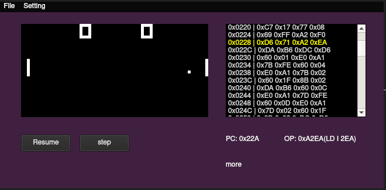

# C8-emu

A chip8 emulator written in cpp using Qt5.

This is a toy project, make a emulator is really just for fun. Still work in progress.

Many functions are completed at the whim, may update this project from time to time(when I am free)

## Feature

- [x] chip8 cpu instructions
- [x] basic canvas render
- [x] open an load ROM
- [x] Start/Pause
- [x] Stepping
- [x] Memory Viewer
- [ ] WIP: keyboard mapping
  - [x] default mapping
  - [ ] support configuration
- [ ] TODO: save and load ROM status
- [ ] TODO: maybe allow lua script?
- [ ] TODO: Sounds

## Quick Start

Qt5, openGL is required

### build

> mkdir build
>
> qmake ..
>
> make

### run

> c8-emu

## Example

## License

WTFPL

